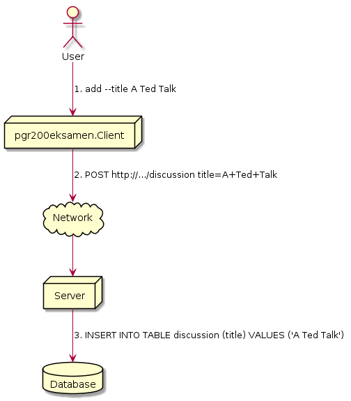
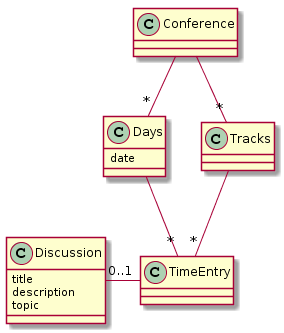
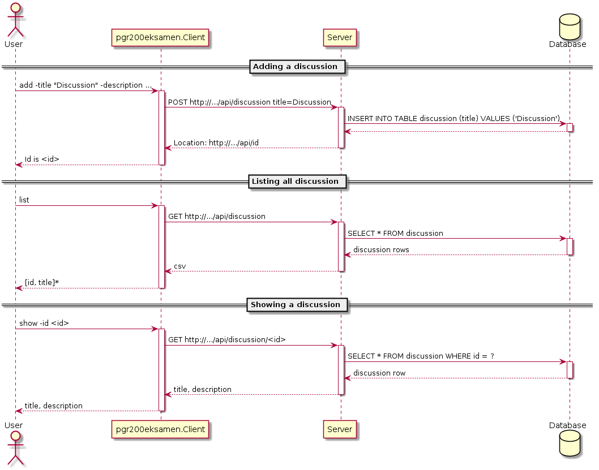

# pgr200eksamen
Java prosjekt

DAO Pattern var en god løsning for modellering av databasen og er oversiktlig ved håndtering av verdier. Det var mye enklere å implementere og/oppdatere databasen og styre den ved bruk av DAO. Flyway gjorde det lett å migrere i databasen.

Løsningen er designet på en måte som gjør at det er enkelt å legge til nye konferanser og nye diskusjoner inni databasen ved å bruke et HTTP client og server som snakker sammen og gjennom den tilkoblingen oppdatere databasen eller hente noe fra databasen.	Når man skal legge inn en diskusjon kjører man en POST Request med innholdet som mottar dataen som skal bli lagd inn også legger det inn i databasen ved bruk av DAO.
	

Kjøre tester: `mvn test`
Kjøre applikasjonen: `mvn install`

kopier 'server-1.0-SNAPSHOT.jar' from server/target til root, 'config.properties' er funnet
kjør via 'java -jar server-1.0-SNAPSHOT.jar'
slutt med CTRL-C

